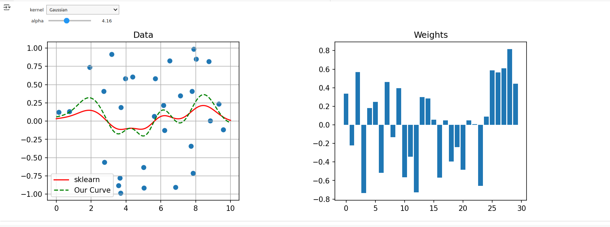

# Kernel-Methods
Special thanks to [@ostadgeorge](https://github.com/ostadgeorge) for the motivation :)

# Kernel Ridge Playground
A notebook to experiment ridge regression with various kernels and lambdas

It also includes the implementation of kernel ridge from scratch

Here's a sample output:

## What are we doing?!

[)%5E2%2B%5Clambda%20%5C%7Cf%5C%7C%5E2_%7B%5Cmathcal%7BH%7D%7D)](#_)
